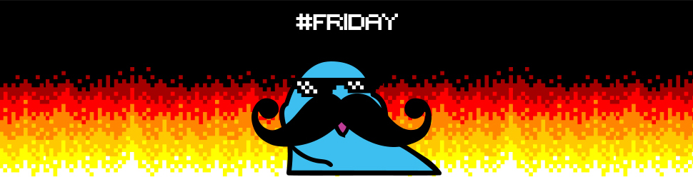
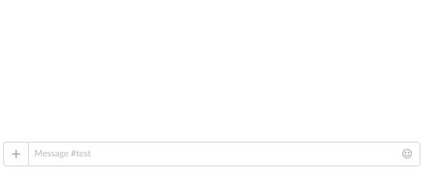
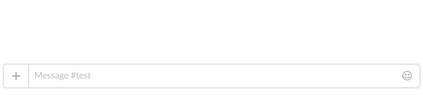
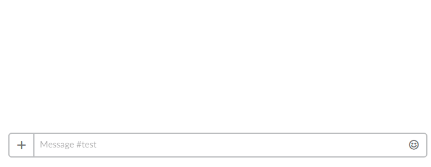
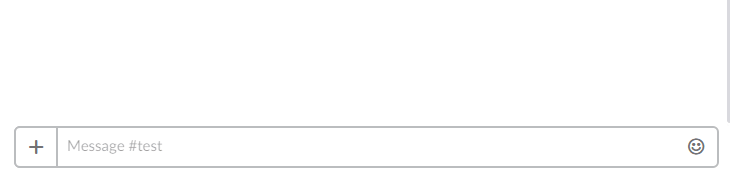
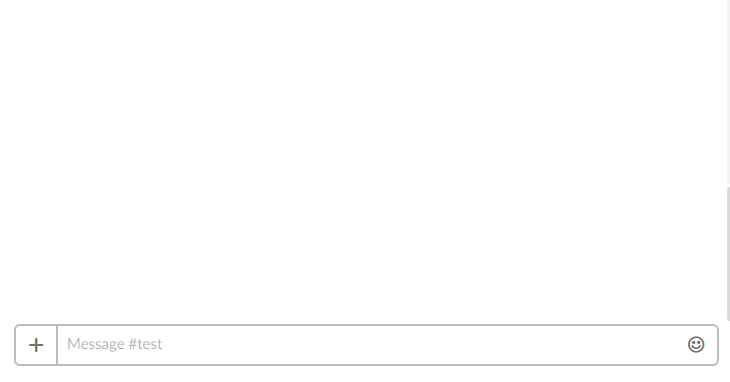
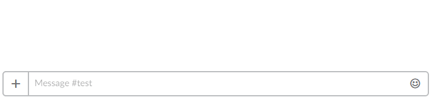
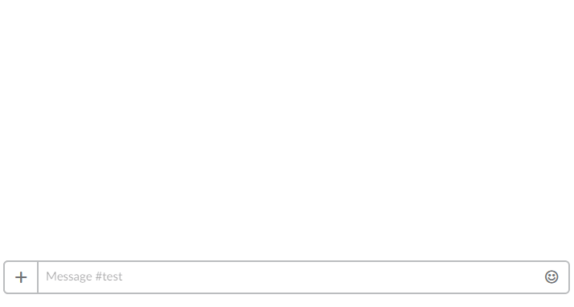

# Fridaybot  

> Бот для slack-канала #friday [SPB Front-end](http://spb-frontend.slack.com)

[Website](http://fridaybot.tk)

## Что умеет бот?
### Список некоторых команд

- Приветствовать новых пользователей:

 

- Прощаться с ушедшими пользователями:

 

- Писать текст из попугаев:

 

- Писать текст из любых emoji:

 

- Считать количество отправленных сообщений:

 

- Считать количество отправленных пэрротов:

 

- Показывать кто больше всех отправляет пэрротов:

 

#### Посмотреть полный список [команд](COMMANDS.md)

## Автор

* **Dmitriy Shved** - [dshved](https://github.com/dshved)

Посмотреть всех [контрибьюторов](https://github.com/dshved/fridaybot/contributors)

### Поддержать разработчика [donate](https://fridaybot.tk/donate)

## Помощь

Пожалуйста прочитайте [CONTRIBUTING.md](CONTRIBUTING.md) для получения подробной информации.

## Лицензия

Этот проект разрабатывается под лицензией - [MIT](LICENSE.md)
